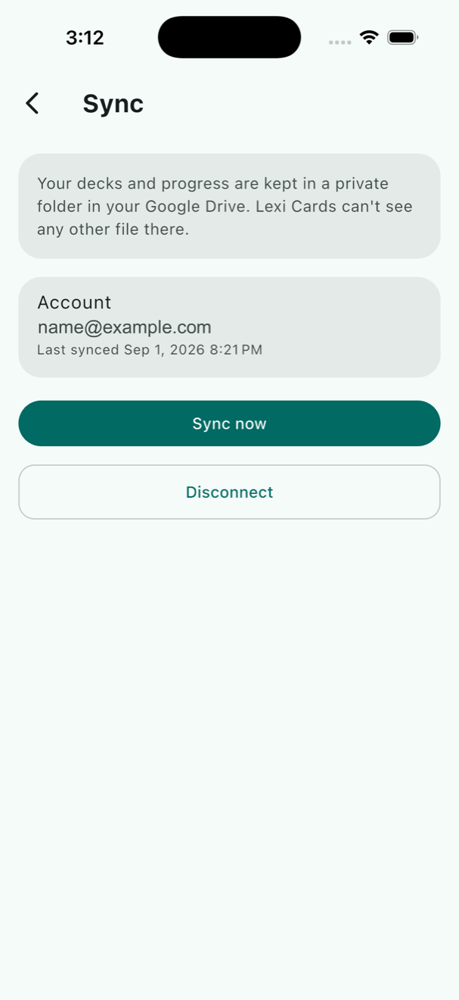

# Lexi Cards

[](https://github.com/devMfawzy/lexi_cards/actions/workflows/ci.yml)

A spaced-repetition flashcard app, Anki-style, built in Flutter. You create decks, add cards, and review them on a schedule driven by the SM-2 algorithm — the same family of algorithm Anki and SuperMemo use. Rate a card Again/Hard/Good/Easy and the app decides when you'll see it next.

Everything lives on the device. There is no account to create, no server to trust, and nothing to pay for — when you turn sync on, your cards go to your own Google Drive and nowhere else.

<p>
  
  
  
  
  
</p>

## What's in it

- **Decks & cards** — create, rename, and delete decks (long-press a deck for Rename/Browse/Delete), add/edit/delete cards. Front and back support rich text (bold, italic, underline, color) via a curated Quill toolbar, Anki-style, plus inline images (gallery, camera, or a pasted link) — resized/recompressed before being stored as base64 data URIs inline in the same field, no separate media store.
- **Review sessions** — due cards are pulled per deck, or across every deck at once via "Study all decks" on the deck list (overdue learning/relearning cards first, then cards due today, then new cards, sorted globally either way), shown one at a time with a flip animation, and rated on a 4-button scale. A card that lands back in learning/relearning (short SM-2 steps, minutes away) stays in the same session — it's held in a pending list and spliced back into the queue once it's due, instead of only reappearing on the next reload.
- **SM-2 scheduling** — new cards go through short learning steps (1m → 10m) before graduating into day-scale review intervals. Ease factor adjusts per rating, lapses send a card back to relearning. Config lives in one place (`sm2_config.dart`) so the constants aren't scattered through the scheduler.
- **Stats** — current and longest streak, retention rate, and 7-day bar charts for reviews done against cards coming due. Every review is logged in full (`ReviewLog`: rating, and interval and ease before and after), so the history is there to compute from rather than derived after the fact.
- **Daily reminders** — an opt-in local notification nudging you back to review, set from Settings. Deliberately scoped to one recurring daily notification rather than per-card/per-due-date scheduling — iOS caps pending local notifications at 64, and rescheduling on every review is a lot of complexity for little gain over a daily nudge. Permission is requested in-context when you flip the toggle, not at cold start.
- **Two-way sync** — link a Google account from Settings and your decks, cards, scheduling and review history stay in step across devices. Storage is the user's own Drive, in the hidden per-app folder, so there is no backend to run and this app can never see another file in their Drive. Not backup-and-restore: two devices that both changed things are genuinely merged, per record.
- **Localization** — English and Arabic (RTL), switchable from Settings with a "System default" option that follows the device language. Built on Flutter's official `flutter gen-l10n`/ARB toolchain rather than a one-off string swap, so adding a third language later is just dropping in another ARB file. Weekday abbreviations use `intl`'s CLDR data (`DateFormat.E(locale)`) instead of a hand-maintained translation.

## Architecture

Feature-first, clean-architecture-ish split. Each feature under `lib/features/` has:

```
domain/        entities + usecases — no Flutter, Hive, or bloc imports
data/          Hive models, local datasource, repository implementation
presentation/  Cubit + pages/widgets
```

`CardRepository` is the interface the domain layer talks to; `CardRepositoryImpl` is the only thing that knows Hive exists. Usecases are thin — mostly one-liners delegating to the repository — except `GetReviewStats`, which does the actual streak/retention/forecast computation and takes an injectable `now` so tests don't depend on the wall clock.

The due-card selection (bucket by learning/review/new, sort each bucket) is deck-agnostic — it's a private `_selectDue(List<Flashcard>)` in `CardRepositoryImpl`, called with either one deck's cards or every card, so `ReviewCubit`/`ReviewPage` just take a nullable `deckId` (null = study across all decks) instead of duplicating the queue logic for a second "combined" mode.

Card front/back are still plain `String` fields in Hive — rich text is Quill Delta JSON stored in that same string. `core/rich_text/quill_content.dart` converts between the two and falls back to treating unparseable content as plain text, so cards created before rich text existed keep working with no data migration. An image is just another embed op in that same Delta, base64-inlined — accepted tradeoff: the Hive box grows for image-heavy decks, in exchange for no file-cleanup lifecycle to get wrong on card/deck delete. Because an image lives *inside* the card record, an uncapped image means an uncapped card. So a picked image is decoded and re-encoded (JPEG for opaque photos, PNG only when the source actually has transparency) against a hard byte ceiling, walking down a ladder of sizes — 1600px, 1200, 900, 640 — until the result fits. All of it runs through `compute()`, since decode/resize/encode on a full-resolution photo is real CPU work. Two cases fall off the end of that ladder: a transparent image PNG simply can't compress far enough gets flattened onto white so JPEG can finish the job, and an image that can't be decoded *and* is already over the ceiling is refused with a message rather than silently inlined.

The undecodable case is an Android one, not the iOS one it looks like: `image_picker` on iOS sniffs the leading byte and re-encodes anything it doesn't recognise — HEIC included — to JPEG before Dart sees it. Android hands the picked file back untouched unless a quality or size limit was requested, and Quill requests neither.

Two bugs here were only visible from using the feature rather than reading it: `Document.toPlainText()` doesn't cover embeds, so an image-only card used to read as blank and get silently rejected by the save button (`isContentBlank` now also checks for embed ops directly). And every embed builder rebuild re-decoded the base64 payload into a fresh `MemoryImage` — since `MemoryImage` has no content-based equality, that meant a visible re-decode flicker on every keystroke while editing (`core/widgets/quill_image_provider_cache.dart` caches by source string to fix it).

`core/notifications/notification_service.dart` wraps `FlutterLocalNotificationsPlugin` behind an injectable interface (mockable in tests, no real platform channel needed) rather than a static/global plugin instance — same DI discipline as everything else here. It's the one piece of infrastructure that lives in `core/` instead of a feature, since it's a cross-cutting OS capability, not domain logic; the `settings` feature owns the *policy* (is it on, what time) and injects the service directly into its cubit rather than routing it through a repository, since scheduling a notification is a side effect, not a persistence concern.

Locale is genuine app-wide state, not per-page like every other cubit here — `LocaleCubit` (`features/settings/presentation/bloc/locale_cubit.dart`) is the one deliberate exception, registered as a DI singleton and read directly by `MaterialApp` above the router, with `SettingsPage` writing to it through the same `SettingsRepository`/`shared_preferences` store as the reminder settings (null language code = follow system).

Two Flutter helper functions couldn't reach `AppLocalizations` because they have no `BuildContext` by design: `cardPreviewLabel` in `core/rich_text/quill_content.dart` is deliberately Flutter-widget-free, and `SettingsCubit` is a cubit, not a widget. Both were fixed the same way — push the localized value in from something that does have a context, rather than give the helper a context it shouldn't need: `cardPreviewLabel` takes its image placeholder as a parameter; `SettingsCubit` emits a small `SettingsFeedback` enum (permission denied, test sent) that `SettingsPage`'s listener maps to text when building the snackbar.

Localization also surfaced a real, non-cosmetic bug: Unicode's bidi algorithm reorders tightly-packed digit content once it's embedded in an Arabic paragraph — a progress counter reading "0 / 1" rendered as "1 / 0", because digits and neutral characters like "/" have no inherent direction of their own and inherit the surrounding RTL context. `core/widgets/ltr_text.dart` (`LtrText`) fixes it narrowly: it forces LTR bidi resolution for that text's own characters while keeping `textAlign` tied to the ambient direction, so the fix doesn't shift where the text sits in an otherwise-mirrored RTL layout.

A follow-up pass audited every fixed-direction layout value in the app (`EdgeInsets.fromLTRB`/`.only`, `Alignment.centerLeft`/`centerRight`, directional icons) against how Flutter actually resolves them under RTL — `Row`/`Column`/`GridView` and `MainAxisAlignment`/`CrossAxisAlignment` already auto-mirror and needed nothing. Two real gaps did not: the swipe-to-delete icon in `deck_list_tile.dart`/`card_list_tile.dart` was pinned to `Alignment.centerRight` inside the `Dismissible` background, so in Arabic it rendered on the wrong edge of the (correctly, automatically mirrored) reveal area — fixed to `AlignmentDirectional.centerEnd`. And the same two tiles' content padding used literal `EdgeInsets.fromLTRB` with an intentionally asymmetric left/right split (more space before the text than after the icon) that doesn't mirror on its own — fixed to `EdgeInsetsDirectional.fromSTEB` so the asymmetry follows reading direction instead of staying pinned to physical sides.

Sync is the largest piece of design here, because the cloud does none of the work. Drive is a blob store: it holds one gzipped file and reports whether it changed. Every decision about what the data *should* be is ours, which means it's pure Dart with no I/O — and by far the most heavily tested code in the app.

The interesting problem is that plain last-write-wins destroys data here. Review a card on your phone, fix a typo in it on your tablet, and a single `updatedAt` per record forces the merge to discard one of them: either the review is silently rolled back, or the typo fix is silently reverted. So a card carries **two independent clocks**, content and scheduling, resolved separately and each moved as a whole — never field by field, since taking `intervalDays` from one side and `easeFactor` from the other invents states the scheduler never produces.

Scheduling is ordered by `reviewCount` before any timestamp. The scheduler already increments it exactly once per review, which makes it a logical clock the app maintains for free — and one a wrong device clock can't corrupt. That matters, because a user setting their clock forward to skip a due date is ordinary behaviour in a spaced-repetition app, not an attack.

Deletion needs a trace or it doesn't survive: without tombstones, a card deleted on one device simply returns from the other. Deleting a deck records *one* tombstone for the deck rather than one per card, and card removal is derived from it — otherwise a card edited concurrently elsewhere outlives its own deck and becomes unreachable, appearing on no deck's page while still being served by "study all decks" and counted in the stats. Tombstones are never aged out, since dropping them after any window lets a device that was offline longer resurrect everything it deleted.

Review logs merge by plain union — immutable and append-only, so they can't conflict. That's the redeeming property of a scheduling clash: the card takes one side's schedule, but *neither* review is lost, so streaks and retention stay complete.

Two details that look like nits and aren't. Every timestamp crosses the wire as an integer of epoch milliseconds, because `toIso8601String()` on a local time carries no offset and the receiving device reparses it in its own zone — which means syncing twice with no edits keeps changing the data, and merge stops being idempotent. And enums travel by name, not by index, so reordering one doesn't silently reinterpret every stored card.

`core/sync/cloud_storage.dart` is an interface rather than the concrete-class-with-an-injected-plugin shape `NotificationService` uses, because there is real polymorphism here and not just a seam for tests — the system file picker and iCloud are both plausible second implementations. Uploads are conditional on the revision the merge was based on, so two devices syncing at once can't silently overwrite each other; Drive has no conditional write, so this compares the version seen a moment earlier and is documented as best-effort rather than atomic.

Wiring:
- `get_it` for DI (registered in `core/di/injection_container.dart`)
- `go_router` for navigation (`core/router/app_router.dart`)
- `flutter_bloc` (Cubit, not full Bloc — no event layer needed here)

## Stack

- Flutter 3.44 / Dart 3.10
- `flutter_bloc`, `equatable`
- `hive_ce` for local storage (no backend — everything's on-device)
- `flutter_quill` + `flutter_quill_extensions` for rich text and inline images; `image` (pure Dart, no native/platform setup) to resize/recompress a picked image before it's inlined
- `flutter_local_notifications` + `timezone` + `flutter_timezone` for the daily reminder; `shared_preferences` for its settings (not worth a Hive box for two scalars)
- `flutter_localizations` (SDK) + `intl` for localization, via `flutter gen-l10n`
- `google_sign_in` + `googleapis` (Drive v3) + `extension_google_sign_in_as_googleapis_auth` for sync. Setting up the OAuth clients is a one-time developer step, written up in [`docs/google-cloud-setup.md`](docs/google-cloud-setup.md)
- `go_router`, `get_it`, `uuid`
- `mocktail` + `bloc_test` for tests

## Running it

```
flutter pub get
flutter run
```

Runs on iOS and Android; both are built in CI on every push. Sync additionally needs OAuth clients registered in a Google Cloud project — a one-time setup written up in [`docs/google-cloud-setup.md`](docs/google-cloud-setup.md). Everything else works without it.

The app icon is generated rather than checked in as an opaque binary:

```
dart run tool/generate_app_icon.dart && dart run flutter_launcher_icons
```

## Tests

```
flutter test
```

Unit tests cover the parts with real logic — the scheduler, the stats maths, the rich-text conversion, and the sync merge:

- `sm2_scheduler_test.dart` — every state transition (new → learning → review, lapses into relearning, ease-factor floor, interval compounding) against a fixed `now`.
- `get_review_stats_test.dart` — streak edge cases (gap breaks it, "reviewed yesterday but not yet today" still counts as active, same-day reviews don't double-count) and retention math.
- `quill_content_test.dart` — Delta JSON round-tripping, the legacy-plain-text fallback (including malformed/non-Delta JSON, which must not throw), collapsing multi-line content into a single-line preview, the image-only-card-isn't-blank fix, the base64 data-URI conversion (including reading a real temp file), and the resize/recompress step: oversized opaque images shrunk as JPEG, transparency preserved as PNG, an already-small image left alone, the dimension ladder stepping down when 1600px would exceed the byte cap, transparency flattened when PNG can't get under it, and undecodable input either embedded as-is or refused depending on its size.
- `review_cubit_test.dart` — the pending-requeue mechanics (a card is held back, promoted once due, left alone if still not due, and a graduated card is never held back at all) against an injectable `now`, using `bloc_test`; also that `loadDueCards()` with no deck queries across every deck.
- `notification_service_test.dart` — mocks the injected `FlutterLocalNotificationsPlugin` to verify the daily reminder is scheduled at the right hour/minute as a repeating (`matchDateTimeComponents: DateTimeComponents.time`) notification, and that it's never scheduled in the past.
- `settings_cubit_test.dart` — enabling only schedules on permission grant (denial leaves it off with an error), disabling cancels, changing the time reschedules only while enabled.
- `settings_repository_impl_test.dart` — round-trips through `SharedPreferences.setMockInitialValues`, including the persisted language code.
- `locale_cubit_test.dart` — loading the persisted locale (or none, following system default) and persisting a new one on change.
- `merge_snapshots_test.dart` — the biggest suite, and the one worth reading. Beyond the per-rule cases it asserts the *algebraic* properties, which are what catch design errors rather than typos: merging a snapshot with itself is a no-op, merging A into B equals merging B into A, merging twice changes nothing the second time, the result doesn't depend on the current time, `reviewCount` never decreases, and no surviving card references a deck that didn't survive. Plus the two cases the two-clock design exists for — a content edit not rolling back a newer review, and a review not reverting a newer edit.
- `sync_snapshot_codec_test.dart` — round-tripping, timestamps surviving between devices in different timezones, unknown enum values from a newer schema falling back rather than throwing, a newer schema version refused outright, and truncated or non-gzip payloads failing loudly instead of half-decoding.
- `sync_repository_impl_test.dart` — the whole pipeline end to end against a fake cloud: Hive to records to merge to gzip and back. Deletions travelling both directions, tombstone times surviving apply un-restamped, an upload clash retrying against the newer copy, and a local review surviving a content edit made elsewhere.
- `adapter_migration_test.dart` — reads a frame that is genuinely *missing* the fields added for sync, rather than one storing them as null. Writing with the current adapter and reading it straight back would pass even if those fields were non-nullable, and the failure that hides lands inside `Hive.openBox` — the deck list would throw on launch for everyone with existing data.
- `local_datasource_test.dart` — that a content edit doesn't erase the record of when a card was last reviewed, that deleting a deck records one tombstone rather than one per card, and that deleting a card keeps its review logs.

## Known limits

Sync uploads the whole snapshot every time rather than only what changed, which is fine for a text-heavy deck and wasteful for one full of photos. Each record already carries a content hash, so the upgrade — a small manifest plus content-addressed blobs, fetching only the images it doesn't have — is a schema-compatible addition that leaves the merge algorithm untouched. That separation is the reason to keep the transport dumb.

Two smaller things follow from the same design. Merging holds the local copy, the remote copy and the result in memory at once, so a very large photo deck is bounded by memory before it's bounded by bandwidth. And conflicts between *content edits* still resolve by wall clock, so two devices editing the same card's text within a badly skewed clock window can resolve the "wrong" way — scheduling sidesteps this entirely via `reviewCount`, but text has no equivalent logical clock. Vector clocks would fix it and are overkill for one person's own devices.

## Author

Mohamed Fawzy — [github.com/devMfawzy](https://github.com/devMfawzy)
