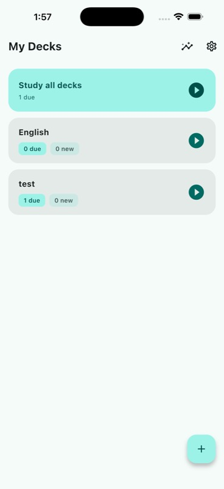
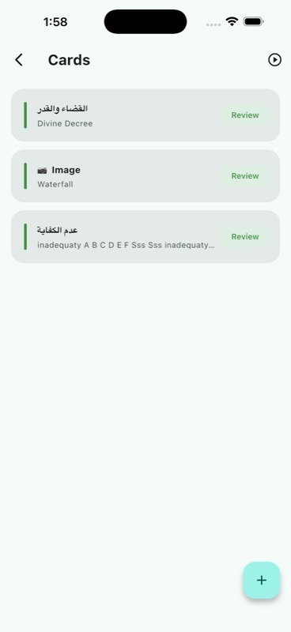
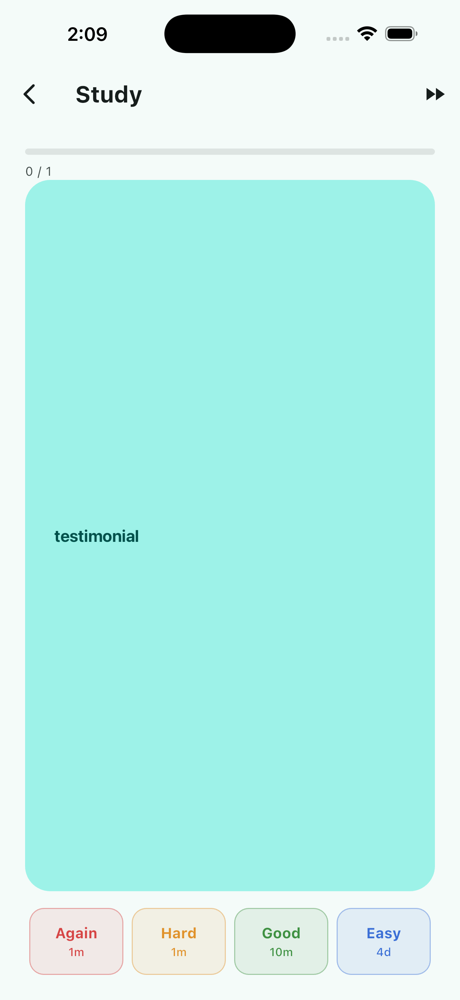
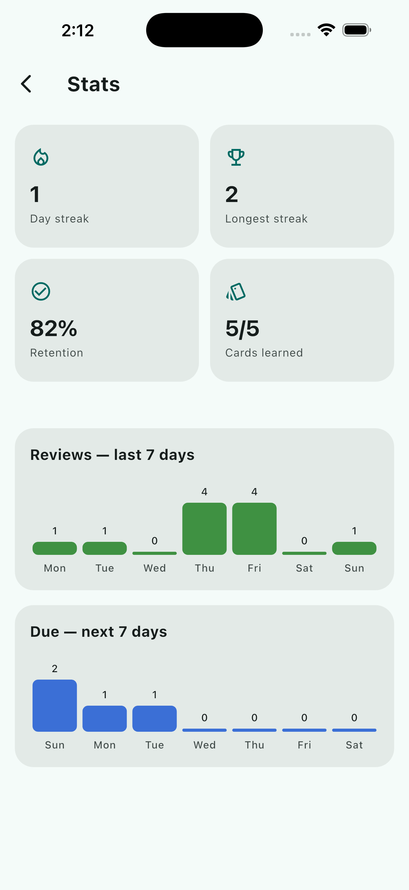

# lexi_cards

A spaced-repetition flashcard app, Anki-style, built in Flutter. You create decks, add cards, and review them on a schedule driven by the SM-2 algorithm — the same family of algorithm Anki and SuperMemo use. Rate a card Again/Hard/Good/Easy and the app decides when you'll see it next.

I built this as a portfolio piece to show a complete, non-trivial Flutter app: clean architecture, BLoC state management, local persistence, and a scheduling algorithm with actual logic worth unit testing — not just CRUD screens.

<p>
  
  
  
  
</p>

## What's in it

- **Decks & cards** — create decks, add/edit/delete cards. Front and back support rich text (bold, italic, underline, color) via a curated Quill toolbar, Anki-style, plus inline images (gallery, camera, or a pasted link) stored as base64 data URIs inline in the same field — no separate media store.
- **Review sessions** — due cards are pulled per deck, or across every deck at once via "Study all decks" on the deck list (overdue learning/relearning cards first, then cards due today, then new cards, sorted globally either way), shown one at a time with a flip animation, and rated on a 4-button scale. A card that lands back in learning/relearning (short SM-2 steps, minutes away) stays in the same session — it's held in a pending list and spliced back into the queue once it's due, instead of only reappearing on the next reload.
- **SM-2 scheduling** — new cards go through short learning steps (1m → 10m) before graduating into day-scale review intervals. Ease factor adjusts per rating, lapses send a card back to relearning. Config lives in one place (`sm2_config.dart`) so the constants aren't scattered through the scheduler.
- **Stats screen** — every review was already being logged (`ReviewLog`: rating, interval before/after, ease before/after) but nothing surfaced it. Added a screen for current/longest streak, retention rate, and 7-day bar charts for reviews done vs. cards coming due.
- **Daily reminders** — an opt-in local notification nudging you back to review, set from a new Settings screen (gear icon). Deliberately scoped to one recurring daily notification rather than per-card/per-due-date scheduling — iOS caps pending local notifications at 64, and rescheduling on every review is a lot of complexity for little gain over a daily nudge. Permission is requested in-context when you flip the toggle, not at cold start.
- **Localization** — English and Arabic (RTL), switchable from Settings with a "System default" option that follows the device language. Built on Flutter's official `flutter gen-l10n`/ARB toolchain rather than a one-off string swap, so adding a third language later is just dropping in another ARB file. Weekday abbreviations use `intl`'s CLDR data (`DateFormat.E(locale)`) instead of a hand-maintained translation.

## Architecture

Feature-first, clean-architecture-ish split. Each feature under `lib/features/` has:

```
domain/        entities + usecases — no Flutter, Hive, or bloc imports
data/          Hive models, local datasource, repository implementation
presentation/  Cubit + pages/widgets
```

`CardRepository` is the interface the domain layer talks to; `CardRepositoryImpl` is the only thing that knows Hive exists. Usecases are thin — mostly one-liners delegating to the repository — except `GetReviewStats`, which does the actual streak/retention/forecast computation and takes an injectable `now` so tests don't depend on the wall clock.

The due-card selection (bucket by learning/review/new, sort each bucket) is deck-agnostic — it's a private `_selectDue(List<Flashcard>)` in `CardRepositoryImpl`, called with either one deck's cards or every card, so `ReviewCubit`/`ReviewPage` just take a nullable `deckId` (null = study across all decks) instead of duplicating the queue logic for a second "combined" mode.

Card front/back are still plain `String` fields in Hive — rich text is Quill Delta JSON stored in that same string. `core/rich_text/quill_content.dart` converts between the two and falls back to treating unparseable content as plain text, so cards created before rich text existed keep working with no data migration. An image is just another embed op in that same Delta, base64-inlined — accepted tradeoff: the Hive box grows for image-heavy decks, in exchange for no file-cleanup lifecycle to get wrong on card/deck delete.

Two real bugs worth calling out because they're the kind that only show up once you actually use the feature, not from reading the diff: `Document.toPlainText()` doesn't cover embeds, so an image-only card used to read as blank and get silently rejected by the save button (`isContentBlank` now also checks for embed ops directly). And every embed builder rebuild re-decoded the base64 payload into a fresh `MemoryImage` — since `MemoryImage` has no content-based equality, that meant a visible re-decode flicker on every keystroke while editing (`core/widgets/quill_image_provider_cache.dart` caches by source string to fix it).

`core/notifications/notification_service.dart` wraps `FlutterLocalNotificationsPlugin` behind an injectable interface (mockable in tests, no real platform channel needed) rather than a static/global plugin instance — same DI discipline as everything else here. It's the one piece of infrastructure that lives in `core/` instead of a feature, since it's a cross-cutting OS capability, not domain logic; the `settings` feature owns the *policy* (is it on, what time) and injects the service directly into its cubit rather than routing it through a repository, since scheduling a notification is a side effect, not a persistence concern.

Locale is genuine app-wide state, not per-page like every other cubit here — `LocaleCubit` (`features/settings/presentation/bloc/locale_cubit.dart`) is the one deliberate exception, registered as a DI singleton and read directly by `MaterialApp` above the router, with `SettingsPage` writing to it through the same `SettingsRepository`/`shared_preferences` store as the reminder settings (null language code = follow system).

Two Flutter helper functions couldn't reach `AppLocalizations` because they have no `BuildContext` by design: `cardPreviewLabel` in `core/rich_text/quill_content.dart` is deliberately Flutter-widget-free, and `SettingsCubit` is a cubit, not a widget. Both were fixed the same way — push the localized value in from something that does have a context, rather than give the helper a context it shouldn't need: `cardPreviewLabel` takes its image placeholder as a parameter; `SettingsCubit` emits a small `SettingsFeedback` enum (permission denied, test sent) that `SettingsPage`'s listener maps to text when building the snackbar.

Localization also surfaced a real, non-cosmetic bug: Unicode's bidi algorithm reorders tightly-packed digit content once it's embedded in an Arabic paragraph — a progress counter reading "0 / 1" rendered as "1 / 0", because digits and neutral characters like "/" have no inherent direction of their own and inherit the surrounding RTL context. `core/widgets/ltr_text.dart` (`LtrText`) fixes it narrowly: it forces LTR bidi resolution for that text's own characters while keeping `textAlign` tied to the ambient direction, so the fix doesn't shift where the text sits in an otherwise-mirrored RTL layout.

Wiring:
- `get_it` for DI (registered in `core/di/injection_container.dart`)
- `go_router` for navigation (`core/router/app_router.dart`)
- `flutter_bloc` (Cubit, not full Bloc — no event layer needed here)

## Stack

- Flutter 3.44 / Dart 3.10
- `flutter_bloc`, `equatable`
- `hive_ce` for local storage (no backend — everything's on-device)
- `flutter_quill` + `flutter_quill_extensions` for rich text and inline images
- `flutter_local_notifications` + `timezone` + `flutter_timezone` for the daily reminder; `shared_preferences` for its settings (not worth a Hive box for two scalars)
- `flutter_localizations` (SDK) + `intl` for localization, via `flutter gen-l10n`
- `go_router`, `get_it`, `uuid`
- `mocktail` + `bloc_test` for tests

## Running it

```
flutter pub get
flutter run
```

Runs on iOS, Android, and web — no platform-specific setup beyond the usual Flutter toolchain.

## Tests

```
flutter test
```

The parts with actual logic worth testing, and all are covered:

- `sm2_scheduler_test.dart` — every state transition (new → learning → review, lapses into relearning, ease-factor floor, interval compounding) against a fixed `now`.
- `get_review_stats_test.dart` — streak edge cases (gap breaks it, "reviewed yesterday but not yet today" still counts as active, same-day reviews don't double-count) and retention math.
- `quill_content_test.dart` — Delta JSON round-tripping, the legacy-plain-text fallback (including malformed/non-Delta JSON, which must not throw), collapsing multi-line content into a single-line preview, the image-only-card-isn't-blank fix, and the base64 data-URI conversion (including reading a real temp file).
- `review_cubit_test.dart` — the pending-requeue mechanics (a card is held back, promoted once due, left alone if still not due, and a graduated card is never held back at all) against an injectable `now`, using `bloc_test`; also that `loadDueCards()` with no deck queries across every deck.
- `notification_service_test.dart` — mocks the injected `FlutterLocalNotificationsPlugin` to verify the daily reminder is scheduled at the right hour/minute as a repeating (`matchDateTimeComponents: DateTimeComponents.time`) notification, and that it's never scheduled in the past.
- `settings_cubit_test.dart` — enabling only schedules on permission grant (denial leaves it off with an error), disabling cancels, changing the time reschedules only while enabled.
- `settings_repository_impl_test.dart` — round-trips through `SharedPreferences.setMockInitialValues`, including the persisted language code.
- `locale_cubit_test.dart` — loading the persisted locale (or none, following system default) and persisting a new one on change.

## What's not here yet

No sync — it's local-only. Decks can also only be created/deleted, not renamed. Picked images aren't compressed/resized before being inlined, so a full-resolution photo can meaningfully bloat a card. Arabic RTL relies on Flutter's automatic `Directionality` mirroring rather than a pixel-perfect audit of every fixed padding/alignment value — no known issues, but not exhaustively checked either. These are the obvious next steps if this grows past a portfolio piece.

## Author

Mohamed Fawzy — [github.com/devMfawzy](https://github.com/devMfawzy)
